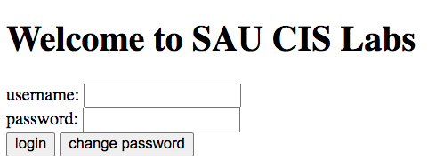
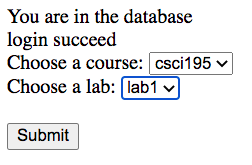
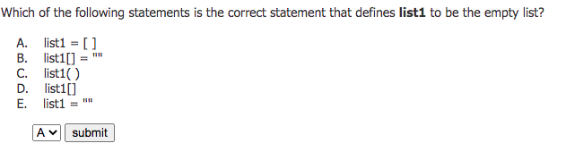
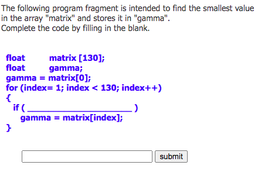
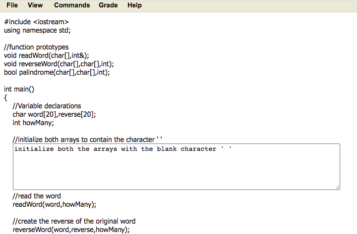

# CSCI 330 Fall 2021
# Final Project: CIS Lab System

## What does CIS lab system look like?
+ 1. Log in

+ 2. Choose course and lab you need to do

+ 3. Answer questions
  - type 1: multiple choice
  
  
  
  - type 2: fill in the blank
  
  
  
  - type 3: programming
  
  
  
## Components
+ Client end
+ Server end
  - Web
  - Database

## Questions
+ How to store the user information?
+ How to store different course, labs, and questions?
+ How to grade the submissions?
+ ...

## Groups
+ Please form your group as soon as possible, each group consists of 4 or 5 students. Once your group is formed, please email me.

## Expected outcomes
+ A lab system that can run locally (on the XAMPP enviroment).
+ A final project presentation.
