# CSCI 330 Fall 2021
# Part 1: HTML

# website
The basic components of a website are:
1. Content: information that is displayed
  + static: content that does not change for different user interactions.
  + dynamic: content that varies based on the user, user input...
2. Instructions
  + Formating: how to display the content
  + Navigation: path between websites
  + Others: Pop-up windows...

# web browser
+ The purpose of a web browser(Chrome, IE, Firefox, Safari) is to **read** HTML documents and **display** them.
+ The browser does not display the HTML tags, but uses them to determine how to display the document.

# website, brower and server

+ Browser is a program that requests and interprets web pages encoded with HTML, etc.
+ server holds web pages and processes browser requests.

# Why do we learn HTML?

+ Every web page is written in a language called HTML.
+ You can think of HTML as the skeleton that gives every **webpage structure**.
+ In this course, we’ll use HTML to add paragraphs, headings, images and links to webpage.

# What is HTML?
+ HTML is a **markup language** for describing web documents(web pages).
  (A markup language is a computer language that uses tags to define elements within a document. By the way, this file is a markdown file, markdown is a lightweight markup language with plain text formatting syntax.)
  + HTML stands for Hyper Text Markup Language. 
  + A markup language is a set of markup tags. 
  + HTML documents are described by HTML tags. 
  + Each HTML tag describes different document.

# HTML Page Structure
There are always two parts to an HTML file: the **head** and the **body**.
+ The head contains information about your HTML file, like its **title**. The title is what we see in the browser’s title bar or page tab.
+ The body is where you put your content, such as **text, images, and links**. The content in the body is what will be visible on the actual page.

example:
~~~~
<!DOCTYPE html>
<html>
<head>
	<title></title>
</head>
<body>

</body>
</html>
~~~~

# HTML tags
HTML tags are keywords (tag names) surrounded by angle brackets:

**`<tagname> content </tagname>`**
+ HTML tags normally come in pairs like `
 and 
`.
+ The first tag in a pair is the **start tag**, the second tag is the **end tag**.
+ The end tag is written like the start tag, but with a **slash** before the tag name.
# Explain the example 	
1. The **DOCTYPE declaration** defines the document type to be HTML.
2. The text between `<html> and </html>` describes an HTML document.
3. The text between `<head> and </head>` provides information about the document.
4. The text between `<title> and </title>` provides a title for the document.
5. The text between `<body> and </body>` describes the visible page content.
# Pay attention to...
+ Always put `<!DOCTYPE html>` on the first line. This tells the browser what language it’s reading (in this case, HTML).
+ Always put `<html>` on the next line. This starts the HTML document.
+ Always put `</html>` on the last line. This ends the HTML document.

# HTML versions
| version        | year           | 
| ------------- |-------------| 
| HTML     | 1991 | 
| HTML2.0     | 1995 |   
| HTML3.2     | 1997 | 
| HTML4.01     | 1999 | 
| XHTML     | 2000 | 
| **HTML5**     | 2014 | 

# HTML Paragraphs
+ HTML paragraphs are defined with the `
 and 
` tag:
+ example: 
	~~~~
	
 This is a paragraph. 

	~~~~
+ Any number of spaces and newlines will be counted as only one space.
	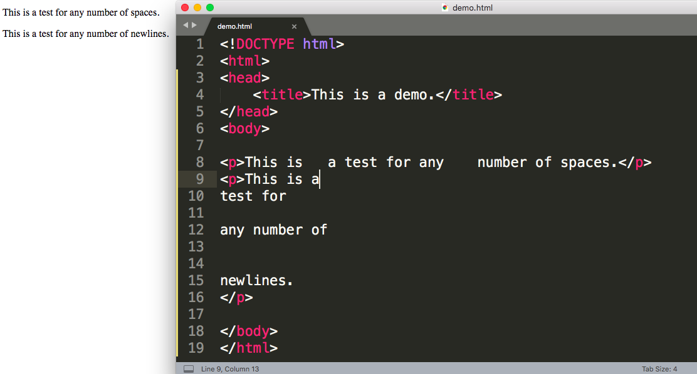
# HTML Headings
+ HTML headings are defined with the `<h1>` to `<h6>` tags.
+ `<h1>` defines the most important heading.
+ `<h6`> defines the least important heading.
example:
	~~~~
	<h1>This is a heading</h1>
	<h2>This is a heading</h2>
	<h3>This is a heading</h3>
	<h4>This is a heading</h4>
	<h5>This is a heading</h5>
	<h6>This is a heading</h6>
	~~~~
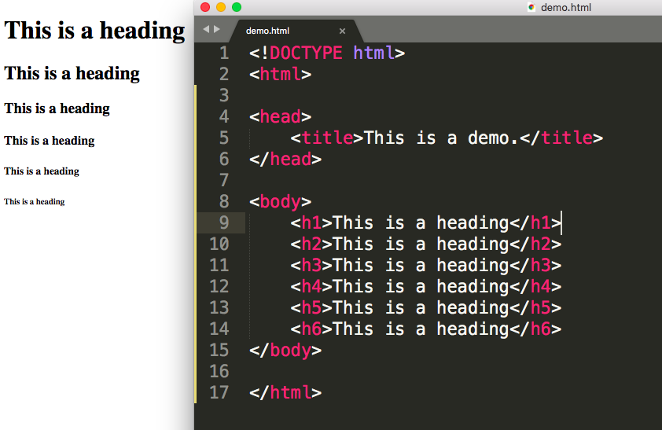

# HTML elements
+ A HTML element is everything from the start tage to the end tag.

example:

| start tag        | element            | end tag  |
| ------------- |-------------| -----|
| `<h1>`     | My first heading | `</h1>`|
| `
`     | My first paragraph | `
`|

# HTML attributes
+ HTML elements can have attributes.
+ Attributes provide **additional information** about an element.
+ Attributes are always specified **in the start tag**.
+ Attributes come in name/value pairs like : **name = 'value'**.

Example: **title** attribute for `

`
~~~~
<!DOCTYPE html>
<html>

<head>
    <title>This is a demo.</title>
</head>

<body>
    
CSCI 330 Web Programming.

</body>

</html>
~~~~

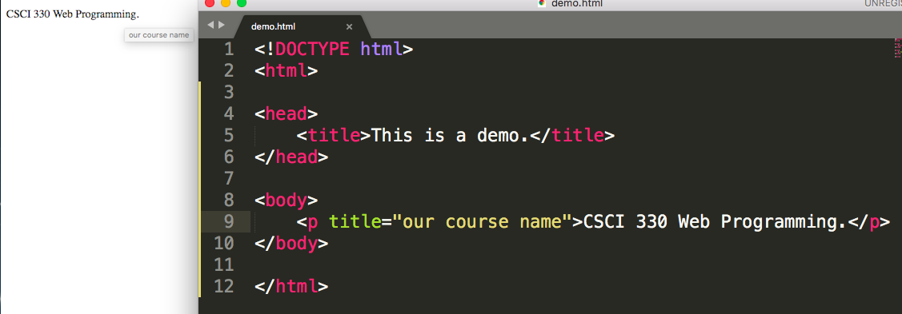

Other examples:
**href** attribute for HTML link tag ``
~~~~
<a href="www.https://zhangningsau.github.io/CSCI330/Fall2019/index.html">Course Webpage</a>
~~~~

**src** attribute for HTML image tag ``
~~~~

~~~~

# HTML Comment tags
+ Comments are not displayed by the browser, but it will help you remember why you did certain things.
+ With comments you can place notifications and reminders in your HTML.
+ Comments tag: `<!– Comments Here –>`

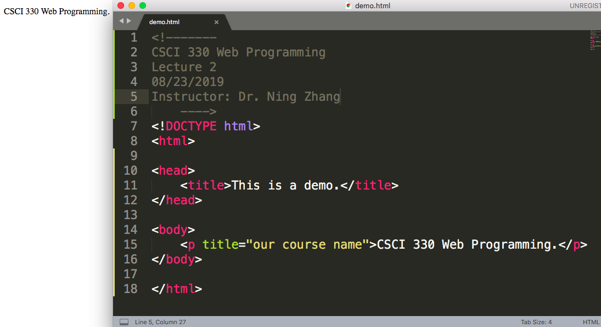

# Indentation is your friend.
+ Indentation really helps make your code more readable!
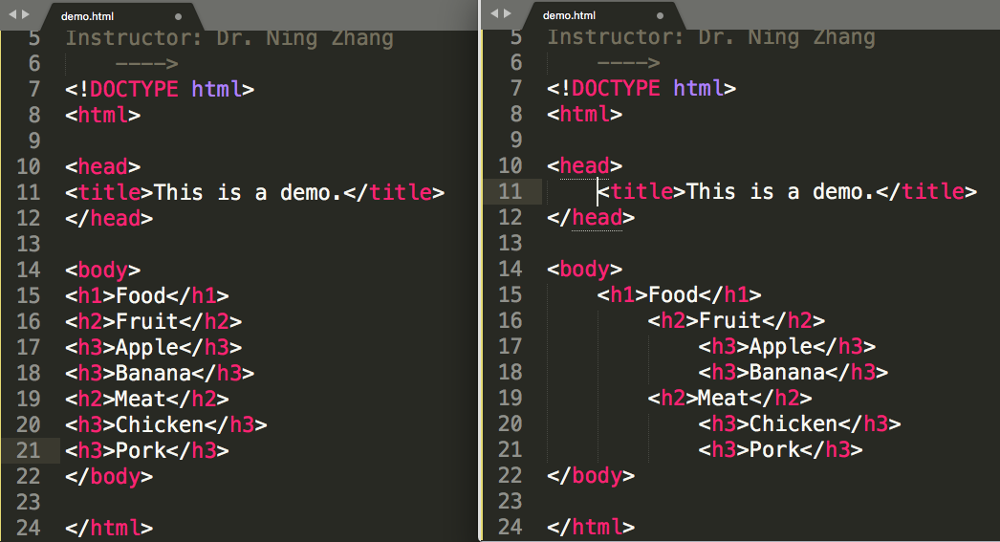

If you use sublime 3, you can install packet control [HTML-CSS-JS Prettify](https://packagecontrol.io/packages/HTML-CSS-JS%20Prettify)(The indentation is not that good.)
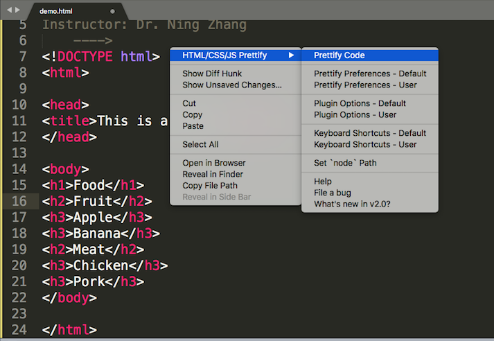
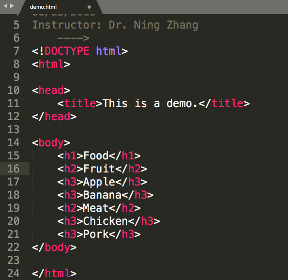

# HTML tip: use lowercase tags
+ HTML tags are not case sensitive, `
` means the same as `
`.
+ If you want to view the HTML source, right-click in the page and select ”View Page Source” (in Chrome) or ”View Source” (in IE), or similar in another browser. This will open a window containing the HTML code of the page.

# Process for developing a website
+ Plan and design the website
+ Create the web pages using an editor
+ Test the web pages
+ Publish the web pages by uploading the pages to the web server.

**The difference between a website and a web page is that a website is a collection of web pages with information on a subject, and a web page is a smaller part of a larger website usually containing more specific information.**

# HTML Editors
+ Notepad++
+ [Atom](https://atom.io/docs/v0.191.0/getting-started-installing-atom)
+ vi/vim/emac
+ sublime

# HTML Images
HTML can display images formats like JPG, PNG, GIF...
For the whole supported image formats, please check [here](https://developer.mozilla.org/en-US/docs/Web/HTML/Element/img).
## syntax
+ In HTML, images are defined with the `` tag.
+ The `` tag is empty, it contains attributes only, and does not have a closing tag.
+ ``, the **src** can be either local or online.
## attributes
+ The **alt** attribute specifies an alternate text for an image, if the image cannot be displayed.
+ The **style** attribute specifies the **height** and **width** of the image, the values are specified in **pixels**.
~~~~

~~~~

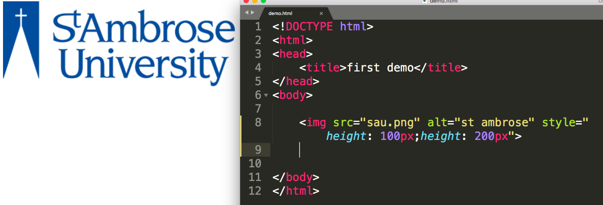
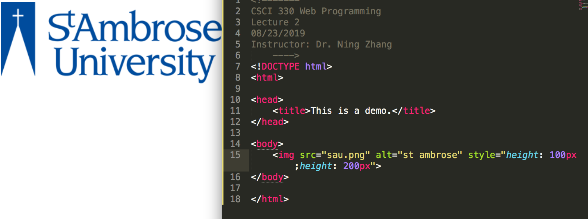

~~~~

~~~~

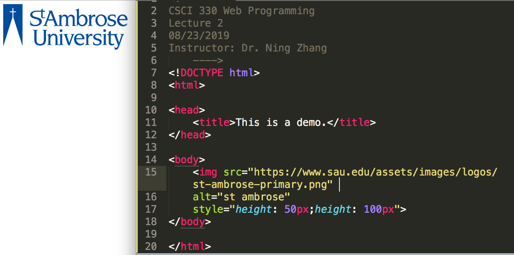

## more on the src attribute
+ For an online image, we use its absolute/full url link.
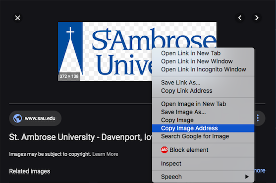
+ For a local image, you can use its absolute/full path or relative path.
	- Q: which one is better for your project?

# HTML Hyperlink
+ HTML link is a hyperlink
+ Hyperlink is a text or image you can click on, and jump to another document.

## syntax
+ In HTML, links are defined with the `<a>` tag. 
+ The href attribute specifies the destination address.
+ The link text is the visible part.
+ The href attribute can be either absolute URL (a full web address) or local link.
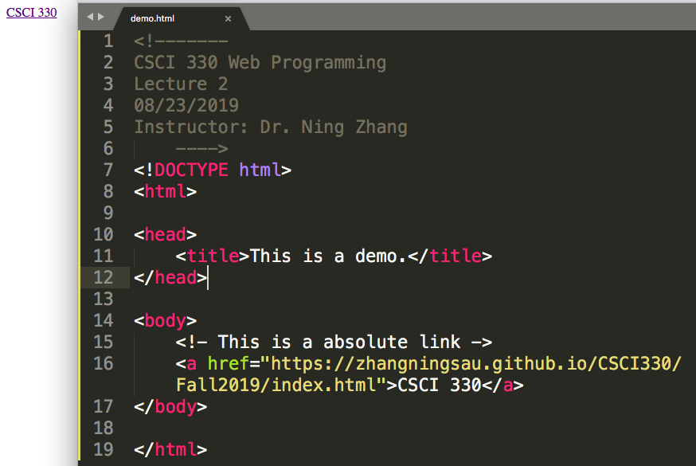
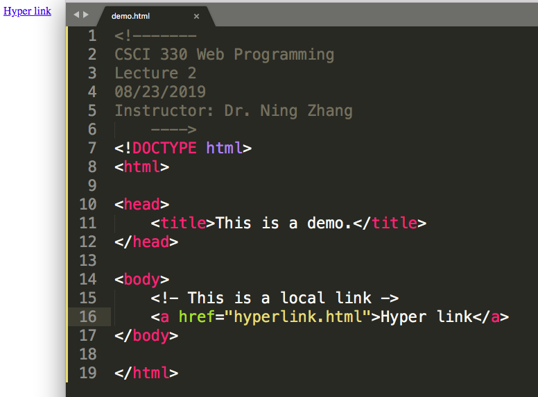

## target attribute
+ The target attribute specifies where to open the linked document.

| Value        | Description           | 
| ------------- |-------------| 
| _blank     | Load in a new window | 
| _self     | Load in the same frame as it was clicked |   
| _parent     | Load in the parent frameset | 
| _top     | Load in the full body of the window | 
| framename    | Load in a named frame | 

~~~~
<a href="https://zhangningsau.github.io/CSCI330/Fall2019/index.html" 
    target="_blank">CSCI 330</a>
~~~~

## create a bookmark
+ HTML bookmarks are used to allow readers to jump to specific parts of a Web page.
+ Bookmarks are practical if your website has long pages.
+ To make a bookmark, you have to first create the bookmark (by the **id** attribute), then add a link (# and the value of the id attribute) to it.
+ Bookmark is just a link to some tag.

~~~~
<h1 id="top">This is the top.</h1>
	
This is a paragraph.

	
This is a paragraph.

	
This is a paragraph.

	
This is a paragraph.

	
This is a paragraph.

	
This is a paragraph.

	
This is a paragraph.

	
This is a paragraph.

	
This is a paragraph.

	
This is a paragraph.

	
This is a paragraph.

	
This is a paragraph.

	
This is a paragraph.

	
This is a paragraph.

	
This is a paragraph.

	
This is a paragraph.

	
This is a paragraph.

	
This is a paragraph.

	
This is a paragraph.

	
This is a paragraph.

    <a href="#top">Go to the top.</a>
   ~~~~

# HTML Lists
## unordered lists

+ An unordered list starts with the <ul> tag.
+ Each list item starts with the <li> tag.

~~~~
	<ul>
		<li>Coffee</li>
		<li>Tea</li>
		<li>Milk</li>
	</ul>
~~~~
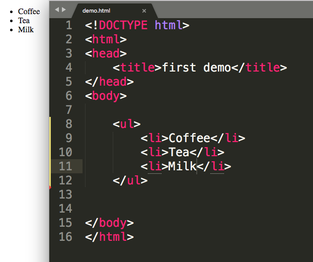
+ A **list-style-type**  attribute can be added to an unordered list, to define the style of the marker
| list-style-type        | Description           | 
| ------------- |-------------| 
| disc     | Sets the list item marker to a bullet (default) |   
| circle     | Sets the list item marker to a circle | 
| square     | Sets the list item marker to a square | 
| none    | The list items will not be marked |

~~~~
<ul style="list-style-type:disc;">
		<li>Coffee</li>
		<li>Tea</li>
		<li>Milk</li>
	</ul>
	<ul style="list-style-type:circle;">
		<li>Coffee</li>
		<li>Tea</li>
		<li>Milk</li>
	</ul>
	<ul style="list-style-type:square;">
		<li>Coffee</li>
		<li>Tea</li>
		<li>Milk</li>
	</ul>
	<ul style="list-style-type:none;">
		<li>Coffee</li>
		<li>Tea</li>
		<li>Milk</li>
	</ul>
~~~~

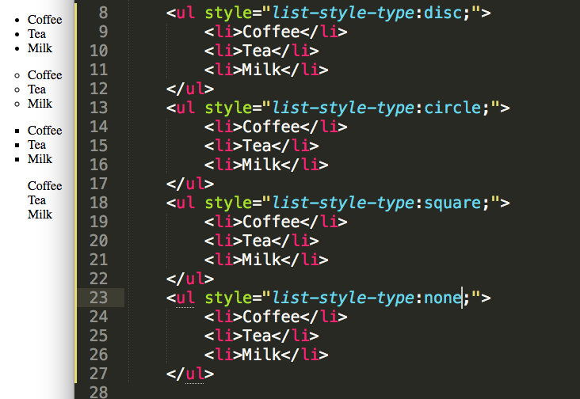

## ordered list
+ An ordered list starts with the <ol> tag.
+ Each list item starts with the <li> tag.
~~~~
	<ol>
		<li>Coffee</li>
		<li>Tea</li>
		<li>Milk</li>
	</ol>
~~~~

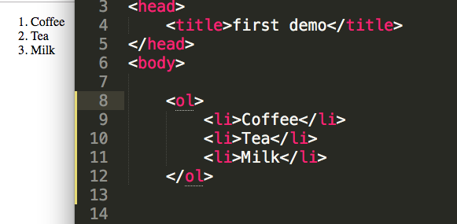

+ The type attribute of the `<ol>` tag, defines the type of the list item marker:
| type        | Description           | 
| ------------- |-------------| 
|type="1"	|The list items will be numbered with numbers (default)|
|type="A"	|The list items will be numbered with uppercase letters|
|type="a"	|The list items will be numbered with lowercase letters|
|type="I"	|The list items will be numbered with uppercase roman numbers|
|type="i"	|The list items will be numbered with lowercase roman numbers|

~~~~
	<ol type="1">
		<li>Coffee</li>
		<li>Tea</li>
		<li>Milk</li>
	</ol>
	<ol type="A">
		<li>Coffee</li>
		<li>Tea</li>
		<li>Milk</li>
	</ol>
	<ol type="a">
		<li>Coffee</li>
		<li>Tea</li>
		<li>Milk</li>
	</ol>
	<ol type="I">
		<li>Coffee</li>
		<li>Tea</li>
		<li>Milk</li>
	</ol>
	<ol type="i">
		<li>Coffee</li>
		<li>Tea</li>
		<li>Milk</li>
	</ol>
~~~~

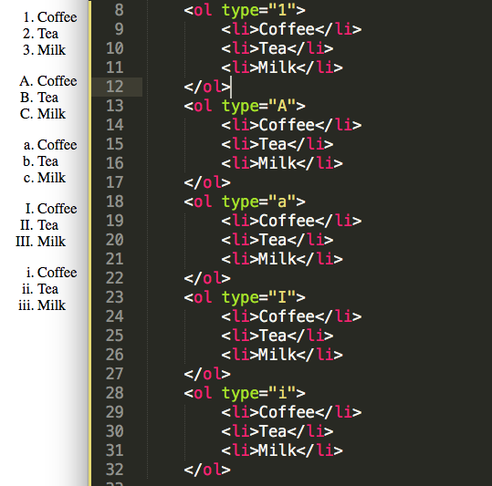

## Nested lists
~~~~
	<ol type="1">
		<li>Coffee</li>
			<ul>
				<li>Espresso</li>
				<li>Cappuccino</li>
			</ul>
		<li>Tea</li>
		<li>Milk</li>
	</ol>
~~~~

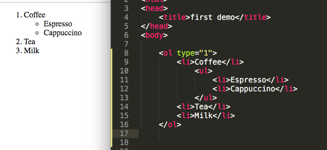
# HTML Formatting
## HTML Bold
+ The HTML `<b>` element defines bold text, without any extra importance.
## HTML Italic
+ The HTML `<i>` element defines italic text, without any extra importance.
## HTML Marked
+ The HTML `<mark>` element defines marked or highlighted text.

~~~~
	
This text is normal.

	
<b>This text is bold.</b>

	
<i>This text is italic.</i>

	
<mark>This text is marked.</mark>
` tag.
+ `<th>` Defines a header cell in a table
+ Tables are divided into table rows with the `<tr>`
tag.
+ Table rows are divided into table data with the
`<td>` tag.
+ A table row can also be divided into table headings with the `<th>` tag.

~~~~
Note: The `<td>` elements are the data containers of the table.
They can contain all sorts of HTML elements; text, images, lists, other tables, etc.
~~~~

+ If you do not specify a border for the table, it will be displayed without borders.
~~~~
    <table>
        <!- first row: headers ->
        <tr>
            <th>Course Title</th>
            <th>Course Name</th>
        </tr>
        <!- second row ->
        <tr>
            <td>CSCI 195</td>
            <td>Programming I</td>
        </tr>
        <!- third row ->
        <tr>
            <td>CSCI 330</td>
            <td>Web Programming</td>
        </tr>
    </table>
~~~~

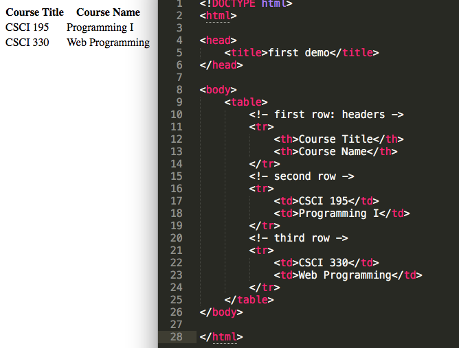

+ A border can be added using the **border** attribute.
~~~~
    <table border="1px">
        <!- first row: headers ->
        <tr>
            <th>Course Title</th>
            <th>Course Name</th>
        </tr>
        <!- second row ->
        <tr>
            <td>CSCI 195</td>
            <td>Programming I</td>
        </tr>
        <!- third row ->
        <tr>
            <td>CSCI 330</td>
            <td>Web Programming</td>
        </tr>
    </table>
~~~~

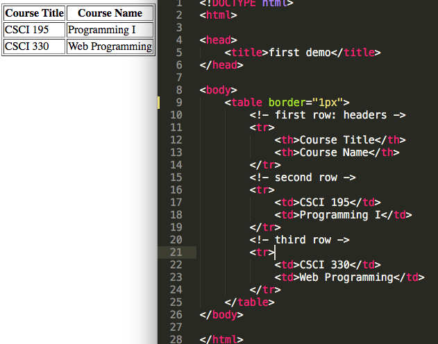

+ Table Cells can Span Many Columns using the **colspan** attribute

~~~~
    <table border="1px">
        <thead>
            <!- table headers->
            <th colspan="2">coure title and name</th>
        </thead>
        <tbody>
            <!- first row->
            <tr>
                <td>csci195</td>
                <td>Programming I</td>
            </tr>
            <!- second row->
            <tr>
                <td>csci330</td>
                <td>Web Programming</td>
            </tr>
        </tbody>
    </table>
~~~~

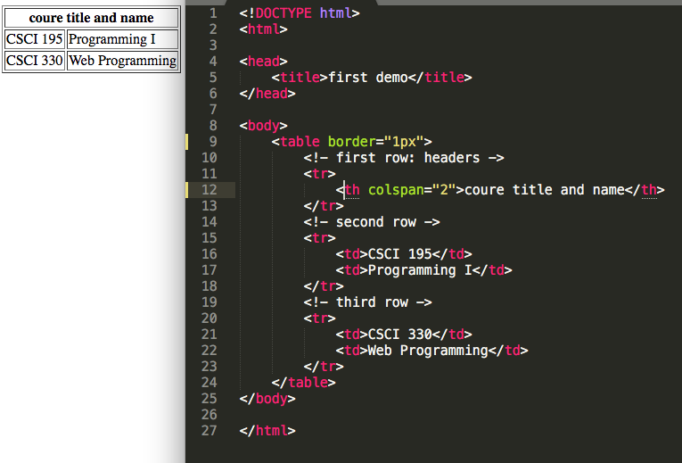

+ Table Cells can span many rows using the **colspan** attribute.
~~~~
    <table border="1px">
        <!- first row: headers ->
        <tr>
            <th colspan="2">coure title and name</th>
        </tr>
        <!- second row ->
        <tr>
            <td rowspan="2">CSCI 195 CSCI 330</td>
            <td>Programming I</td>
        </tr>
        <!- third row ->
        <tr>
            <td>Web Programming</td>
        </tr>
    </table>
~~~~
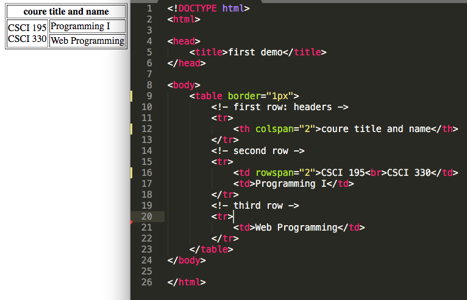

# [Homework 1](https://github.com/ZhangNingSAU/Fall-2021-CSCI-330-Web-Programming/blob/master/Homework/HW1.md)
