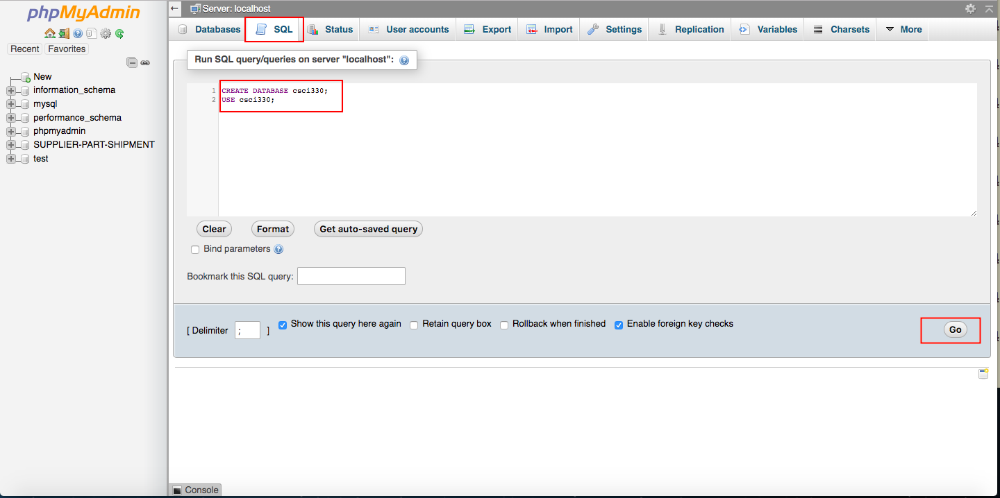

# In this tutorial, I will export and import a dabase named csci330
# Part I: Export a database (save a database named csci330.sql)
## csci330 -> Export -> Go -> csci330.sql

# Part II: Import a databas (csci330.sql)
## Create a database named csci330 if it does not exist
### You can do it using MySQL queries

### or do it manually

## Import csci330.sql

